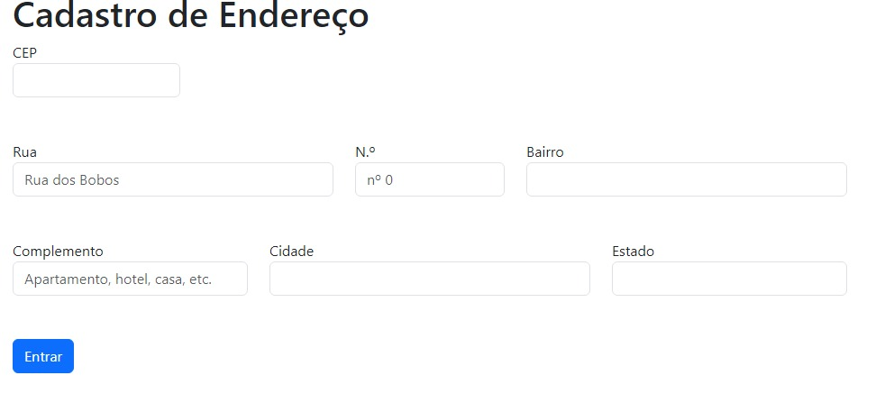

# Indice
[CadEndereço](#cadastro-endereço)  
[Descrição](#descrição)  
[Introduçao](#introdução)  
[Funcionalidade](#funcionalidade)  
[Funcionalidade desses Campos](#funcionalidade-dos-campos)
[Tecnologias Utilizadas](#tecnologias-utilizadas)  
[Fontes Consulta](#fontes-consulta)  
[Autores](#autores)  

# Cadastro de endereço

## Descrição
o projeto formulário de cadastro de endereço tem como funcionalidade demonstrar a utilização da linguagem de JavaScript para o consumo de API de endereço que esta disponível no site ViaCEP.
## Introdução
Projeto com intuito de realizar campo de cadastro através de um formulário.
## Funcionalidade
Tem como funcionalidade o meio de preencher os campos de endereço de forma automática assim que coloca o cep.
## Funcionalidade desses Campos
* ``async``
* [ASYNC](https://www.alura.com.br/artigos/async-await-no-javascript-o-que-e-e-quando-usar)-
 Nos permitem usar generators para pausar a execução de uma função.

* ``await``
* [AWAIT](https://www.alura.com.br/artigos/async-await-no-javascript-o-que-e-e-quando-usar)-
 Faz a execução de uma função async pausar, para esperar pelo retorno da Promise.

* ``hasOwnProperty``
* [hasOwnProperty](https://developer.mozilla.org/pt-BR/docs/Web/JavaScript/Reference/Global_Objects/Object/hasOwnProperty)-
É uma função integrada no JavaScript que permite verificar se um objeto possui uma determinada propriedade.

* ``fetch``
* [FETCH](https://developer.mozilla.org/pt-BR/docs/Web/API/Fetch_API/Using_Fetch)-
É uma interface JavaScript moderna para fazer requisições HTTP/HTTPS de forma assíncrona
## Tecnologias Utilizadas
* ``HTML5``
* ``CSS3``
* ``VSCODE``
* ``BOOTSTRAP``
* ``GITHUB``
* ``GIT``

## Fontes Consulta
* [ViaCep](http://viacep.com.br/ws/$%7Bcep.value%7D/json/`)

* [BootStrap](https://getbootstrap.com/docs/5.0/forms/layout/#gutters)
## Autores
Julia Eduarda de Lima Barbosa